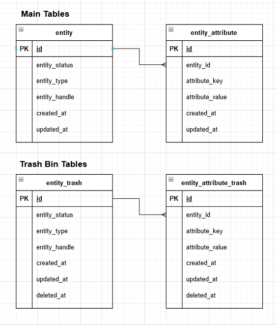

# Entity Store


Modern "schemaless" storage using a relational (SQL) database. Document database interface for relational databases. 

## Features
- Ultimate flexibility and convenience, no schema changes
- Implemented via an EAV (entity-attribute-value) pattern to keep the relational structure and avoid blobs (JSON) fields
- Single store can store unlimited number of entities of any type
- Single store can store unlimited number of attributes for each entity
- Multiple stores can be used to store specific types
- Attributes can store any type of data - strings, integers, floating point numbers, any interfaces
- 99% of required storage functionality provided out of the box
- Full SQL available for more sophisticated cases - reporting, diagrams, etc.
- Supports soft deletes via separate trash bin tables

## Installation
```
go get -u github.com/gouniverse/entitystore
```

## Setup

```golang
entityStore, err := NewStore(NewStoreOptions{
	DB:                 db,
	EntityTableName:    "entities_entity",
	AttributeTableName: "entities_attribute",
	AutomigrateEnabled: true,
})
```

## Usage

1. Create a new entity
```golang
person := entityStore.EntityCreate("person")
person.SetString("name","Jon Doe")
person.SetInt("age", 32)
person.SetFloat("salary", 1234.56)
person.SetInterface("kids", []string{"Tina","Sam"})
```

2. Retrieve an entity
```golang
personID := "{THE PERSON ID}"
person := entityStore.EntityFindByID(personID)
person.GetString("name")
person.GetInt("age")
person.GetFloat("salary")
person.GetInterface("kids")
```


## Database Schema



## Methods

These methods may be subject to change

### Store Methods


- AttributeCreate(entityID string, attributeKey string, attributeValue string) *Attribute - creates a new attribute
- AttributeFind(entityID string, attributeKey string) *Attribute - finds an attribute by ID
- AttributeSetFloat(entityID string, attributeKey string, attributeValue float64) error - upserts a new float attribute
- AttributeSetInt(entityID string, attributeKey string, attributeValue int64) error -  upserts a new int attribute
- AttributeSetString(entityID string, attributeKey string, attributeValue string) error -  upserts a new interface{} attribute
- AttributeSetString(entityID string, attributeKey string, attributeValue string) error -  upserts a new string attribute
- AutoMigrate() - auto migrate
- EntityCount(entityType string) uint64 - counts entities
- EntityCreate(entityType string) *Entity - creates a new entity
- EntityCreateWithAttributes(entityType string, attributes map[string]interface{}) *Entity
- EntityDelete(entityID string) - deletes an entity and all attributes
- EntityFindByID(entityID string) *Entity - finds an entity by ID
- EntityFindByAttribute(entityType string, attributeKey string, attributeValue string) *Entity - finds an entity by attribute
- EntityList(entityType string, offset uint64, perPage uint64, search string, orderBy string, sort string) []Entity - lists entities
- EntityListByAttribute(entityType string, attributeKey string, attributeValue string) []Entity - finds an entity by attribute
- EntityTrash(entityID string) - moves an entity and all its attributes to the trash bin
- GetAttributeTableName() string
- GetAttributeTrashTableName() string
- GetDB() *sql.DB
- GetEntityTableName() string
- GetEntityTrashTableName() string


### Entity Methods

- Delete() bool - deletes the entity
- GetInt(attributeKey string, defaultValue int64) (int64, error) - the value of the attribute as string or the default value if it does not exist
- GetFloat(attributeKey string, defaultValue float64) (float64, error) - the value of the attribute as float or the default value if it does not exist
- GetInterface(attributeKey string, defaultValue interface{}) interface{} - the value of the attribute as interface{} or the default value if it does not exist
- GetString(attributeKey string, defaultValue string) string - the value of the attribute as string or the default value if it does not exist
- GetAttribute(attributeKey string) *Attribute - returns an attribute by key
- SetFloat(attributeKey string, attributeValue float64) bool - sets an attribute with float value
- SetInt(attributeKey string, attributeValue int64) bool - sets an attribute with int value
- SetInterface(attributeKey string, attributeValue interface{}) bool - sets an attribute with string value
- SetString(attributeKey string, attributeValue string) bool - sets an attribute with string value

### Attribute Methods

- GetInterface() interface{} - de-serializes the JSON value
- GetInt() (int64, error) - returns the value as int
- GetFloat() (float64, error) - returns the value as float
- GetString() string - returns the value as string
- SetFloat(value float64) bool - saves a float value
- SetInt(value int64) bool - saves a int value
- SetInterface(value interface{}) bool - serializes the interface to JSON string and saves it
- SetString(value string) bool - saves a string value

## Similar Packages
- https://github.com/sebastienros/yessql (.NET)
- https://github.com/laurent22/go-sqlkv (GO)
- https://github.com/greensea/sqljsondb
